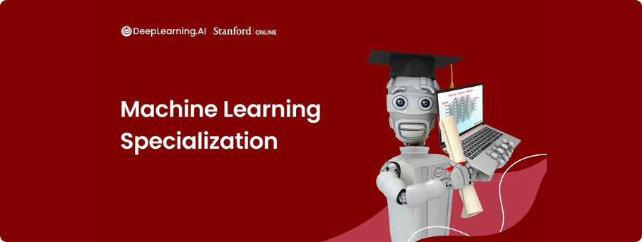

  

# Machine Learning Specialization

This repository showcases my journey through the `Machine Learning Specialization` on Coursera, offered by `DeepLearning.AI` in collaboration with `Stanford Online`. It contains notes, code implementations, and projects from the 3-course series.

## About the Specialization

The Machine Learning Specialization is an updated and expanded version of Andrew Ng's pioneering Machine Learning course. Taught by **Andrew Ng**, this beginner-friendly program provides a comprehensive introduction to modern machine learning. It covers supervised learning, unsupervised learning, and key best practices used in the field.

## Courses in the Specialization

### `Course 1|` Supervised Machine Learning: Regression and Classification

Learn the fundamentals of predictions, regression, and classification tasks. There are 3 modules in this course:

- `Week 1|` Introduction to Machine Learning
- `Week 2|` Regression with multiple input variables
- `Week 3|` Classification

**Earned Certificate**: [Supervised Machine Learning: Regression and Classification](https://coursera.org/share/789489cb15a016ca08d5d4377bca23af)

### `Course 2|` Advanced Learning Algorithms

Explore decision trees, ensemble methods, and neural network training. There are 4 modules in this course:

- `Week 1|` Neural Networks
- `Week 2|` Neural network training
- `Week 3|` Advice for applying machine learning
- `Week 4|` Decision trees

**Earned Certificate**: [Advanced Learning Algorithms](https://coursera.org/share/a5be0e2325dc9e4c0dfab17d30719635)

### `Course 3|` Unsupervised Learning, Recommenders, Reinforcement Learning

Learn how to work with data without labels, personalize recommendations, and build agents that learn from interactions. There are 3 modules in this course:

- `Week 1|` Unsupervised learning
- `Week 2|` Recommender systems
- `Week 3|` Reinforcement learning

**Earned Certificate**: [Unsupervised Learning, Recommenders, Reinforcement Learning](https://coursera.org/share/71aa2bcf08739a91cd90e67c57c973dc)

## Learning Goals

By completing this specialization, I aim to:

- Build machine learning models in Python using libraries like NumPy and scikit-learn.
- Train and evaluate supervised models such as linear regression, logistic regression, and neural networks.
- Implement unsupervised learning techniques like clustering and dimensionality reduction.
- Build recommender systems and deep reinforcement learning models.
- Apply best practices for model evaluation and improvement.

## Repository Contents

- **Notes**: Summaries of concepts, techniques, and formulas covered in the courses.
- **Projects**: Hands-on projects implementing ML models and algorithms.
- **Code**: Python scripts and Jupyter notebooks for course exercises.

## Technologies Used

- **Programming Language**: Python
- **Libraries**: NumPy, Matplotlib, Scikit-learn, TensorFlow
- **Tools**: Jupyter Notebook, Git

## Acknowledgements

This specialization is taught by **Andrew Ng**, a renowned AI researcher and educator, and is developed in partnership with DeepLearning.AI and Stanford Online.

Feel free to explore, learn, and contribute!
